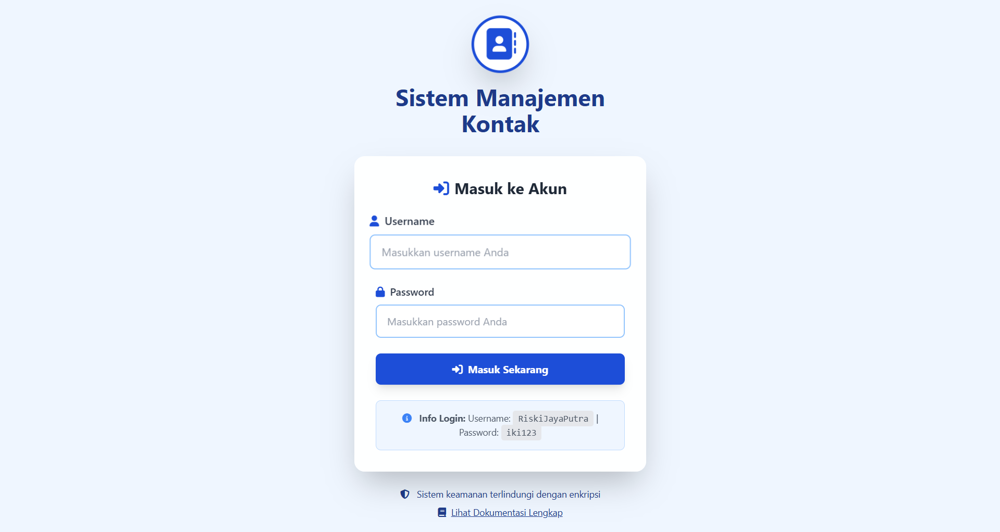
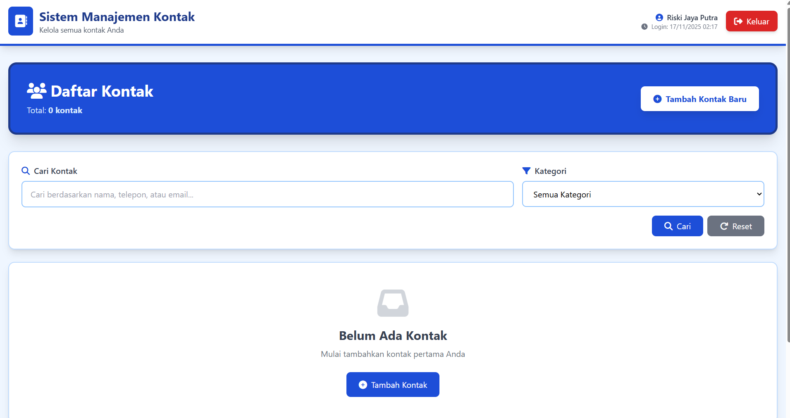
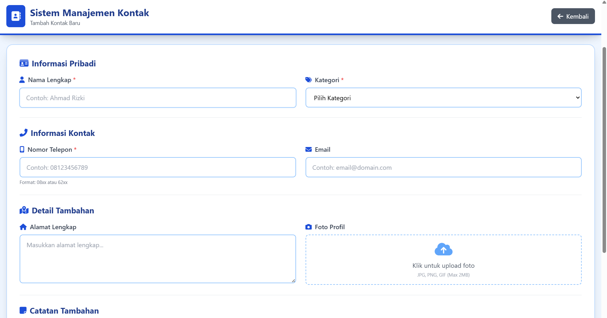

# Sistem Manajemen Kontak

Aplikasi web untuk mengelola kontak dengan fitur lengkap menggunakan PHP dan Tailwind CSS.

## ✨ Fitur

- 🔐 **Sistem Login & Session Management** - Autentikasi pengguna dengan session yang aman
- 📸 **Upload Foto Kontak** - Tambahkan foto profil untuk setiap kontak (JPG, PNG, GIF - maks 2MB)
- ➕ **Tambah Kontak** - Form dengan validasi lengkap untuk menambahkan kontak baru
- ✏️ **Edit Kontak** - Perbarui informasi kontak yang sudah ada
- 🗑️ **Hapus Kontak** - Menghapus kontak dari sistem beserta foto
- 🔍 **Pencarian & Filter** - Cari kontak berdasarkan nama, telepon, atau email dan filter berdasarkan kategori
- 📱 **Validasi Nomor Telepon Indonesia** - Format otomatis untuk nomor telepon Indonesia
- ✅ **Validasi Email & Data** - Validasi email dan sanitasi input untuk keamanan
- 📄 **Pagination** - Tampilan data dengan pagination untuk performa optimal
- 🎨 **Animasi Smooth** - Animasi halus dan transisi yang menarik
- 📱 **Responsive Design** - Tampilan optimal di semua perangkat
- 🕐 **Timezone WIB** - Menampilkan waktu login sesuai zona waktu Asia/Jakarta

## 🛠️ Teknologi

- **Backend**: PHP 7.4+
- **Storage**: JSON Files (tanpa database)
- **Frontend**: HTML5, Tailwind CSS 3.0
- **Icons**: Font Awesome 6.4
- **Color Scheme**: Solid Blue (#1e40af, #1e3a8a) dengan aksen profesional

## 📋 Persyaratan Sistem

- PHP 7.4 atau lebih tinggi
- Web server (Apache/Nginx) atau PHP built-in server
- Browser modern (Chrome, Firefox, Safari, Edge)

## 🚀 Cara Instalasi

1. **Clone atau Download Repository**

   ```bash
   git clone https://github.com/RiskiJayaPutra/Sistem-Manajemen-Kontak.git
   cd Sistem-Manajemen-Kontak
   ```

2. **Jalankan dengan PHP Built-in Server**

   ```bash
   php -S localhost:8000
   ```

3. **Buka Browser**

   ```
   http://localhost:8000/login.php
   ```

4. **Login dengan kredensial default**

   - Username: `RiskiJayaPutra`
   - Password: `iki123`

## 📸 Screenshot Aplikasi

### Halaman Login

Halaman login dengan desain modern dan warna solid blue yang elegan.

### Halaman Utama (Dashboard)

Dashboard dengan tampilan kartu kontak, fitur pencarian, filter kategori, dan pagination.

### Halaman Tambah & Edit Kontak

Form untuk menambah dan mengedit kontak dengan validasi lengkap dan upload foto.

## 📁 Struktur File

```
Judul 4/
├── functions.php           # Fungsi helper dan manajemen data
├── login.php               # Halaman login
├── index.php               # Halaman utama (daftar kontak)
├── tambah-kontak.php       # Halaman tambah kontak
├── edit-kontak.php         # Halaman edit kontak
├── hapus-kontak.php        # Script hapus kontak
├── logout.php              # Script logout
├── dokumentasi.html        # Dokumentasi lengkap
├── data/                   # Folder untuk menyimpan file JSON
│   ├── kontak.json         # Data kontak (auto-generated)
│   └── users.json          # Data users (auto-generated)
├── uploads/                # Folder untuk menyimpan foto kontak
│   └── .gitkeep            # Keep folder in git
├── .gitignore              # Git ignore file
└── README.md               # Dokumentasi
```

## 🎯 Cara Penggunaan

### Login

1. Akses `login.php`
2. Masukkan username: `RiskiJayaPutra` dan password: `iki123`
3. Klik "Masuk Sekarang"

### Menambah Kontak

1. Di halaman utama, klik tombol "Tambah Kontak Baru"
2. Isi formulir dengan informasi kontak:
   - Foto (opsional) - Upload foto profil (JPG/PNG/GIF, maks 2MB)
   - Nama Lengkap (wajib)
   - Nomor Telepon (wajib) - Format: 08xxx atau 62xxx
   - Email (opsional)
   - Kategori (wajib) - Pilih: Keluarga, Teman, Kerja, Bisnis, atau Lainnya
   - Alamat (opsional)
   - Catatan (opsional)
3. Klik "Simpan Kontak"

### Mencari Kontak

1. Gunakan kotak pencarian di bagian atas
2. Ketik nama, nomor telepon, atau email
3. Pilih kategori untuk filter lebih spesifik
4. Klik "Cari"

### Mengedit Kontak

1. Di kartu kontak, klik tombol "Edit"
2. Ubah informasi yang diperlukan (termasuk foto jika ingin diganti)
3. Klik "Simpan Perubahan"

### Menghapus Kontak

1. Di kartu kontak, klik tombol "Hapus"
2. Konfirmasi penghapusan
3. Kontak beserta foto akan dihapus dari sistem

## 🔒 Fitur Keamanan

- ✅ Password di-hash menggunakan `password_hash()`
- ✅ Validasi dan sanitasi semua input pengguna
- ✅ Proteksi terhadap XSS menggunakan `htmlspecialchars()`
- ✅ Validasi data yang ketat untuk email dan nomor telepon
- ✅ Session management yang aman
- ✅ JSON file storage dengan permission kontrol

## 🎨 Kategori Kontak

- 👨‍👩‍👧‍👦 **Keluarga** - Untuk kontak keluarga
- 👥 **Teman** - Untuk teman dekat
- 💼 **Kerja** - Untuk rekan kerja
- 🤝 **Bisnis** - Untuk partner bisnis
- 📌 **Lainnya** - Untuk kategori lainnya

## 🐛 Troubleshooting

### File data tidak terbuat

- Pastikan folder `data/` memiliki permission untuk menulis
- File JSON akan otomatis dibuat saat pertama kali aplikasi dijalankan

### Upload foto gagal

- Pastikan folder `uploads/` ada dan dapat ditulis
- Cek ukuran file (maksimal 2MB)
- Pastikan format file adalah JPG, PNG, atau GIF

### Session tidak berfungsi

- Pastikan `session.save_path` di php.ini dapat ditulis
- Cek apakah cookies aktif di browser

## 📝 Catatan Pengembangan

Aplikasi ini dibuat sebagai tugas akhir praktikum Pemrograman Web dengan spesifikasi:

- Form handling dengan validasi
- Session management dengan timezone WIB (Asia/Jakarta)
- File upload untuk foto kontak
- CRUD operations dengan JSON storage
- Clean code tanpa komentar untuk kode produksi

## 📄 Lisensi

Proyek ini dibuat untuk keperluan edukasi praktikum Pemrograman Web.

## 👨‍💻 Pengembang

**Dibuat oleh Riski Jaya Putra**

Dikembangkan sebagai bagian dari Praktikum Pemrograman Web - Jurusan Teknik Elektro, Universitas Lampung.

---

**Selamat menggunakan Sistem Manajemen Kontak!** 🎉
